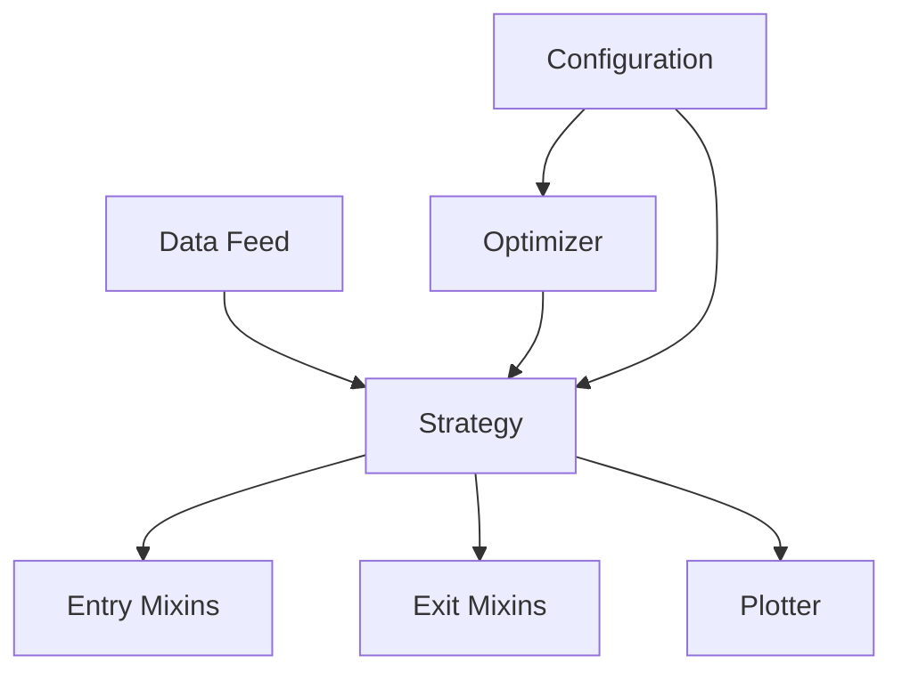
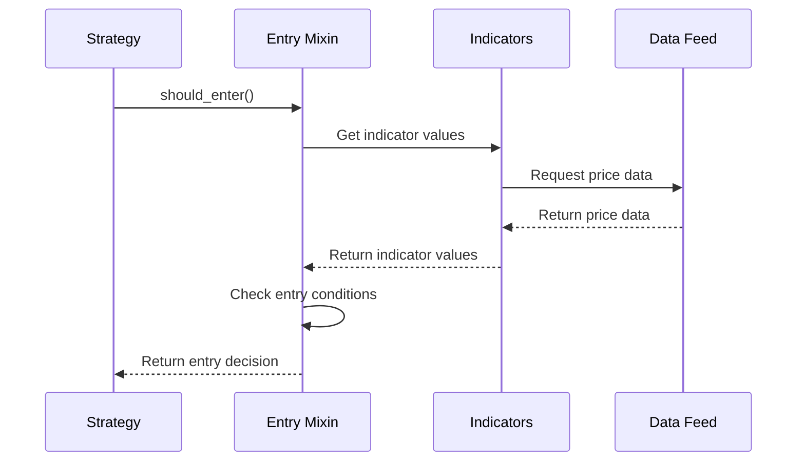
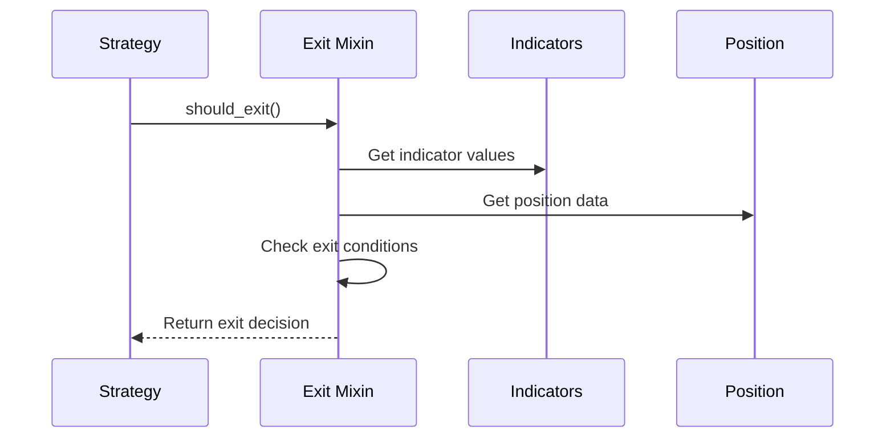

# Developer Guide

## Core Components

### System Architecture


### Strategy
The Strategy is the main container and orchestrator of the trading system. It:
- Holds the data feed (test or live market data)
- Manages the entry and exit mixins
- Tracks positions and trades
- Maintains the equity curve
- Handles order execution
- Provides logging and monitoring capabilities

Example Strategy Configuration:
```python
strategy_config = {
    "data": {
        "type": "csv",
        "path": "data/btc_usdt_1h.csv",
        "timeframe": "1h"
    },
    "entry_logic": {
        "name": "RSIBBEntryMixin",
        "params": {
            "rsi_period": 14,
            "rsi_oversold": 30,
            "bb_period": 20,
            "bb_stddev": 2.0
        }
    },
    "exit_logic": {
        "name": "TrailingStopExitMixin",
        "params": {
            "atr_period": 14,
            "atr_multiplier": 2.0
        }
    }
}
```

### Optimizer
The Optimizer is responsible for finding the optimal parameter combinations for strategies. It:
- Takes configuration files defining parameter ranges
- Generates parameter combinations to test
- Runs backtests with different parameter sets
- Evaluates results using specified metrics (e.g., profit, Sharpe ratio)
- Identifies the best performing parameter combinations
- Can use different optimization methods (grid search, genetic algorithms, etc.)

Example Optimization Configuration:
```json
{
    "strategy": {
        "entry_logic": {
            "name": "RSIBBEntryMixin",
            "params": {
                "rsi_period": {
                    "type": "int",
                    "min": 5,
                    "max": 30,
                    "step": 1
                },
                "rsi_oversold": {
                    "type": "float",
                    "min": 20,
                    "max": 40,
                    "step": 1
                }
            }
        }
    },
    "optimization": {
        "method": "grid_search",
        "metric": "sharpe_ratio",
        "timeframe": "1h",
        "start_date": "2023-01-01",
        "end_date": "2023-12-31"
    }
}
```

### Entry Mixins
Entry Mixins define when to enter trades. Each mixin:
- Implements a specific entry strategy (e.g., RSI, Bollinger Bands)
- Manages its own technical indicators
- Defines entry conditions through the `should_enter()` method
- Handles parameter validation and defaults
- Can be combined with other mixins for complex strategies

Example Entry Mixin Flow:


### Exit Mixins
Exit Mixins determine when to exit trades. Each mixin:
- Implements a specific exit strategy (e.g., trailing stop, time-based)
- Manages its own technical indicators
- Defines exit conditions through the `should_exit()` method
- Handles parameter validation and defaults
- Can be combined with other mixins for complex strategies

Example Exit Mixin Flow:


### Data Feed
The Data Feed provides market data to the strategy. It:
- Can be historical data for backtesting
- Can be live market data for trading
- Provides OHLCV (Open, High, Low, Close, Volume) data
- Handles data normalization and preprocessing
- Manages data timeframes and resampling

Example Data Feed Configuration:
```python
data_config = {
    "type": "csv",  # or "live" for real-time data
    "path": "data/btc_usdt_1h.csv",
    "timeframe": "1h",
    "columns": {
        "datetime": "timestamp",
        "open": "open",
        "high": "high",
        "low": "low",
        "close": "close",
        "volume": "volume"
    },
    "preprocessing": {
        "normalize": True,
        "fill_missing": True
    }
}
```

### Plotter
The Plotter visualizes strategy results. It:
- Creates price charts with indicators
- Shows entry and exit points
- Displays the equity curve
- Supports multiple subplots for different indicators
- Provides customization options for visualization

Example Plot Configuration:
```python
plot_config = {
    "style": "dark_background",
    "size": [15, 10],
    "dpi": 300,
    "show_grid": True,
    "show_equity_curve": True,
    "indicators": {
        "rsi": {"subplot": "separate", "color": "blue"},
        "bb": {"subplot": "price", "color": "red"},
        "volume": {"subplot": "separate", "color": "green"}
    }
}
```

### Component Interaction Example
Here's how the components work together in a typical trading scenario:

1. **Strategy Initialization**:
```python
# Create strategy with configuration
strategy = CustomStrategy(strategy_config)

# Initialize data feed
data_feed = DataFeed(data_config)
strategy.add_data(data_feed)

# Initialize entry and exit mixins
entry_mixin = EntryMixinFactory.create(entry_config)
exit_mixin = ExitMixinFactory.create(exit_config)
strategy.set_entry_mixin(entry_mixin)
strategy.set_exit_mixin(exit_mixin)
```

2. **Trading Loop**:
```python
# Strategy processes each bar
for bar in strategy.data:
    # Check entry conditions
    if not strategy.position and entry_mixin.should_enter():
        strategy.buy()
    
    # Check exit conditions
    if strategy.position and exit_mixin.should_exit():
        strategy.sell()
    
    # Update indicators and metrics
    strategy.update_indicators()
    strategy.update_metrics()
```

3. **Optimization Process**:
```python
# Create optimizer
optimizer = Optimizer(optimization_config)

# Run optimization
results = optimizer.optimize(strategy_config)

# Get best parameters
best_params = results.get_best_parameters()

# Create strategy with optimized parameters
optimized_strategy = CustomStrategy({
    **strategy_config,
    "entry_logic": {"params": best_params["entry"]},
    "exit_logic": {"params": best_params["exit"]}
})
```

4. **Result Visualization**:
```python
# Create plotter
plotter = BasePlotter(
    data=strategy.data,
    trades=strategy.trades,
    strategy=strategy,
    vis_settings=plot_config
)

# Generate and save plot
plotter.plot("results/strategy_backtest.png")
```

## Adding New Entry/Exit Mixins

### Creating a New Mixin

1. Create a new file in the appropriate directory:
   - For entry mixins: `src/entry/your_mixin_name_mixin.py`
   - For exit mixins: `src/exit/your_mixin_name_mixin.py`

2. Implement your mixin class following this template:

```python
from typing import Any, Dict
import backtrader as bt
from src.entry.entry_mixin import BaseEntryMixin  # or BaseExitMixin for exit mixins

class YourMixin(BaseEntryMixin):  # or BaseExitMixin for exit mixins
    """Your mixin description"""
    
    def get_required_params(self) -> list:
        """List of required parameters"""
        return []
    
    def get_default_params(self) -> Dict[str, Any]:
        """Default parameter values"""
        return {
            "param1": default_value1,
            "param2": default_value2,
        }
    
    def _init_indicators(self):
        """Initialize your indicators"""
        if self.strategy is None:
            raise ValueError("Strategy must be set before initializing indicators")
            
        # Create your indicators here
        # Example:
        self.indicators["indicator1"] = bt.indicators.YourIndicator(
            self.strategy.data.close,
            period=self.get_param("param1")
        )
    
    def should_enter(self) -> bool:  # or should_exit() for exit mixins
        """Your entry/exit logic"""
        if not self.indicators:
            return False
            
        # Implement your logic here
        return your_condition
```

### Registering Your Mixin

1. Add your mixin to the appropriate factory:
   - For entry mixins: `src/entry/entry_mixin_factory.py`
   - For exit mixins: `src/exit/exit_mixin_factory.py`

2. Import your mixin and add it to the registry:

```python
from src.entry.your_mixin_name_mixin import YourMixin  # or appropriate path

ENTRY_MIXIN_REGISTRY = {
    # ... existing mixins ...
    "YourMixin": YourMixin,
}
```

### Creating Configuration Files

1. Create a JSON configuration file in the appropriate directory:
   - For entry mixins: `config/optimizer/entry/your_mixin_name.json`
   - For exit mixins: `config/optimizer/exit/your_mixin_name.json`

2. Define the configuration structure:

```json
{
    "name": "YourMixin",
    "params": {
        "param1": {
            "type": "int",  // or "float", "bool"
            "min": 5,       // for numeric types
            "max": 30,      // for numeric types
            "default": 10
        },
        "param2": {
            "type": "float",
            "min": 0.1,
            "max": 1.0,
            "default": 0.5
        },
        "param3": {
            "type": "bool",
            "default": true
        }
    },
    "description": "Description of your mixin's strategy and parameters"
}
```

3. Configuration file guidelines:
   - Use descriptive parameter names
   - Set reasonable min/max values for optimization
   - Include default values that work well in most cases
   - Add a clear description of the strategy
   - Document any special parameter requirements

Example configuration for RSI and Bollinger Bands mixin:

```json
{
    "name": "RSIBBExitMixin",
    "params": {
        "rsi_period": {
            "type": "int",
            "min": 5,
            "max": 30,
            "default": 14
        },
        "rsi_overbought": {
            "type": "float",
            "min": 60,
            "max": 90,
            "default": 70
        },
        "bb_period": {
            "type": "int",
            "min": 10,
            "max": 50,
            "default": 20
        },
        "bb_stddev": {
            "type": "float",
            "min": 1.0,
            "max": 3.0,
            "default": 2.0
        },
        "use_bb_touch": {
            "type": "bool",
            "default": true
        }
    },
    "description": "Exit strategy based on RSI overbought condition and Bollinger Bands upper band touch. Exits when RSI is overbought and price touches or crosses above the upper Bollinger Band."
}
```

### Using Your Mixin

1. Create a strategy configuration using your mixin:

```python
strategy_config = {
    "entry_logic": {  # or "exit_logic" for exit mixins
        "name": "YourMixin",
        "params": {
            "param1": value1,
            "param2": value2,
        }
    },
    # ... other configuration ...
}
```

2. Use the configuration with the CustomStrategy:

```python
strategy = CustomStrategy(strategy_config=strategy_config)
```

### Best Practices

1. **Indicator Management**:
   - Each mixin maintains its own `indicators` dictionary
   - Use unique names for indicators within your mixin
   - Initialize indicators in `_init_indicators()`

2. **Parameter Handling**:
   - Define default values in `get_default_params()`
   - List required parameters in `get_required_params()`
   - Use `self.get_param()` to safely access parameters

3. **Documentation**:
   - Add docstrings explaining your mixin's purpose
   - Document all parameters and their effects
   - Include usage examples in comments

4. **Testing**:
   - Test your mixin with different parameter combinations
   - Verify indicator calculations
   - Test edge cases and error conditions

5. **Configuration**:
   - Create comprehensive configuration files
   - Set appropriate optimization ranges
   - Document parameter relationships and dependencies
   - Include clear strategy descriptions

### Example: RSI and Bollinger Bands Mixin

Here's a complete example of creating a new mixin:

```python
"""
RSI and Bollinger Bands Mixin

This module implements a strategy based on RSI and Bollinger Bands.
The strategy enters/exits when:
1. RSI is in the oversold/overbought zone
2. Price touches the lower/upper Bollinger Band

Parameters:
    rsi_period (int): Period for RSI calculation
    rsi_threshold (float): RSI threshold for signals
    bb_period (int): Period for Bollinger Bands
    bb_stddev (float): Standard deviation multiplier
"""

class RSIBBMixin(BaseEntryMixin):
    def get_default_params(self) -> Dict[str, Any]:
        return {
            "rsi_period": 14,
            "rsi_threshold": 30,
            "bb_period": 20,
            "bb_stddev": 2.0,
        }
    
    def _init_indicators(self):
        self.indicators["rsi"] = bt.indicators.RSI(
            self.strategy.data.close,
            period=self.get_param("rsi_period")
        )
        
        bb = bt.indicators.BollingerBands(
            self.strategy.data.close,
            period=self.get_param("bb_period"),
            devfactor=self.get_param("bb_stddev")
        )
        self.indicators["bb_upper"] = bb.lines.top
        self.indicators["bb_lower"] = bb.lines.bot
    
    def should_enter(self) -> bool:
        rsi = self.indicators["rsi"][0]
        price = self.strategy.data.close[0]
        bb_lower = self.indicators["bb_lower"][0]
        
        return (rsi < self.get_param("rsi_threshold") and 
                price <= bb_lower * 1.01)
``` 